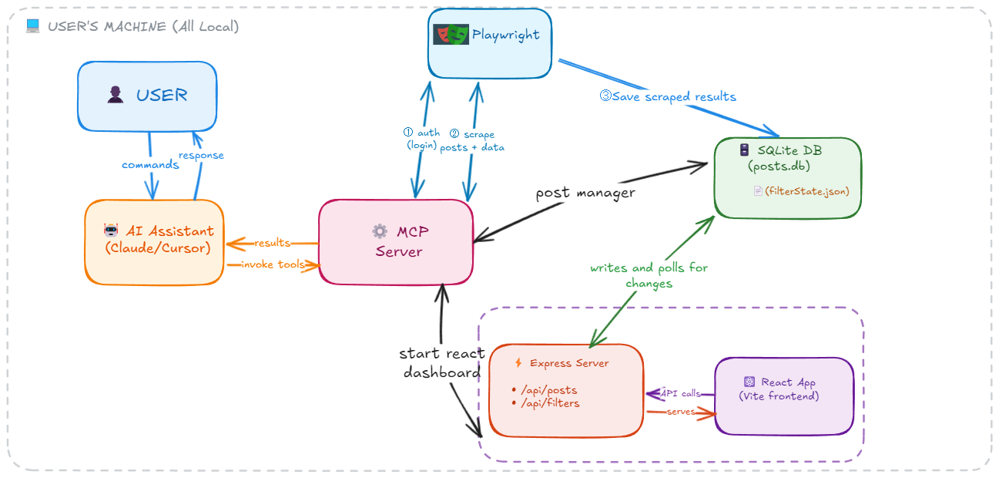

<div align="center">
  
  
  # LinkedIn Posts Hunter MCP Server
  
  **Automate LinkedIn job post searching and tracking with AI-powered assistance**
  
  [](https://modelcontextprotocol.io)
  [](https://www.typescriptlang.org/)
  [](https://playwright.dev/)
  [](https://react.dev/)
  [](https://expressjs.com/)
  [](https://vitejs.dev/)
  [](https://tailwindcss.com/)
  
  ---
  
  [](https://ko-fi.com/kevinweitgenant)
  
</div>

---

## 📖 Overview

**LinkedIn Posts Hunter MCP** is a Model Context Protocol (MCP) server that provides tools for automating LinkedIn job post search and management through your AI assistant (Claude Desktop, Cursor, or other MCP-compatible clients).

**Why LinkedIn Posts?** Job opportunities often appear in LinkedIn posts first, before they're posted on traditional job boards. By monitoring LinkedIn posts, you can discover opportunities earlier and get a competitive advantage in your job search.

### How it works:

**1. Authentication & Scraping**
- The MCP server exposes a Playwright-based tool that your AI assistant can invoke to automate browser interactions with LinkedIn
- First-time use requires logging into LinkedIn through a browser window to capture session cookies
- These cookies are **stored locally on your computer** for persistent authentication
- Once authenticated, your AI assistant can call the search tool with keywords (either from your conversation or suggested by the AI) to scrape job posts

**2. Local Data Storage**
- All scraped posts are saved to a **local SQLite database** on your machine
- The database stores post content, metadata (author, dates, engagement metrics), and tracking info (whether you've applied)
- Your data never leaves your computer

**3. Visual Interface**
- A separate tool launches a **React dashboard** that renders the scraped posts from your local database
- **Visualize all your scraped posts** in table or card views with profile images and engagement metrics
- **Track your applications** by marking posts as "applied" or "saved for later" directly in the UI
- **Quick actions** let you filter, sort, and manage posts with point-and-click simplicity
- Changes made in the React app are written to the local database. And changes made through MCP commands are reflected in the UI.

**4. Dual Control**
- You can manage posts through **either** the React UI **or** through MCP tools like `manage_posts` and `viewer_filters`
- The React app updates via **polling**, so changes made through MCP commands are reflected in the UI
- This gives you flexibility: use natural language commands with your AI assistant, or point-and-click in the dashboard

---

## 🎬 Video Demo

See LinkedIn Posts Hunter in action! Watch how to search, manage, and track LinkedIn job posts through your AI assistant.

[](https://youtube.com/watch?v=VIDEO_ID)
*Click to watch the full demo video*

---

### 🎨 Diagram

<div align="center">
  
  <p><em>System architecture showing components and their interactions</em></p>
</div>

---


## 🛠️ Available Tools

This MCP server exposes **6 tools** that can be called from your AI assistant:

### 1. `auth`
Manage LinkedIn authentication with persistent session storage.

**Parameters:**
- `action`: `"authenticate"` | `"status"` | `"clear"`
- `force_reauth`: boolean (optional)

**Usage:**
```
"Authenticate my LinkedIn account"
"Check LinkedIn auth status"
"Clear my LinkedIn credentials"
```

### 2. `search_posts`
Search LinkedIn posts by keywords and save results to the database.

**Parameters:**
- `keywords`: string (e.g., "Python developer remote")
- `pagination`: number (1-10, default: 3)

**Usage:**
```
"Search LinkedIn for 'AI engineer' jobs"
"Find posts about 'React developer' with 5 pages"
```

### 3. `manage_posts`
Read, update, or delete posts from the database with advanced filtering.

**Parameters:**
- `action`: `"read"` | `"update"` | `"delete"`
- `ids`: number[] (optional)
- `search_text`: string (optional)
- `date_from`: string (YYYY-MM-DD, optional)
- `date_to`: string (YYYY-MM-DD, optional)
- `applied`: boolean (optional)
- `limit`: number (1-50, default: 10)
- `new_description`: string (for updates)
- `new_keywords`: string (for updates)
- `new_applied`: boolean (for updates)

**Usage:**
```
"Show me posts I haven't applied to yet"
"Mark post ID 42 as applied"
"Delete all posts older than January 1st"
```

### 4. `viewer_filters`
Control the React UI filters programmatically from the AI conversation.

**Parameters:**
- `keyword`: string (optional)
- `applied_status`: `"all"` | `"applied"` | `"not-applied"` (optional)
- `start_date`: string (YYYY-MM-DD, optional)
- `end_date`: string (YYYY-MM-DD, optional)
- `ids`: string (comma-separated, optional)
- `reset`: boolean (optional)

**Usage:**
```
"Filter to show only unapplied posts"
"Show posts from this week"
"Reset all filters"
```

### 5. `start_viewer`
Launch the React dashboard in your browser with hot reload enabled.

**Usage:**
```
"Open the LinkedIn post viewer"
"Start the dashboard"
```

### 6. `stop_viewer`
Stop the running Vite development server.

**Usage:**
```
"Close the viewer"
"Stop the dashboard"
```

---

## 📦 Installation

### Prerequisites

- **Node.js** 18 or higher
- **npm** (comes with Node.js)
- A LinkedIn account
- **Cursor IDE** or **Claude Desktop**

---

### Method 1: Download Pre-built .mcpb Package (Claude Desktop Only) 🎁

**Works for:** Claude Desktop only

**💡 Easiest method!** This is the simplest installation option - just one click! However, the `.mcpb` format is still relatively new and not yet widely adopted by the MCP community.

1. **Download the latest `.mcpb` file** from the [Releases page](https://github.com/kevin-weitgenant/LinkedIn-Posts-Hunter-MCP-Server/releases)

2. **Install with one click:**
   - Double-click the `.mcpb` file, or
   - Drag it onto the Claude Desktop app

3. **Done!** Claude Desktop automatically configures everything for you.

---

### Method 2: Using mcp.json Configuration (Recommended) ⭐

**Works for:** Cursor IDE and Claude Desktop

This is the most reliable and widely-supported installation method.

1. **Install globally:**
   ```bash
   npm install -g linkedin-posts-hunter-mcp
   ```

   **What you'll see:**
   - Package download progress with visible feedback
   - Dependency installation (~234 packages)
   - Playwright Chromium browser download (~300MB)
   - Installation typically completes in 1-3 minutes
   
   ✅ You'll know exactly when the installation is complete!

2. **Add to your MCP configuration:**

   **For Cursor IDE:**
   
   Open or create `mcp.json` at:
   - **macOS/Linux:** `~/.cursor/mcp.json`
   - **Windows:** `%USERPROFILE%\.cursor\mcp.json` (typically `C:\Users\YourName\.cursor\mcp.json`)
   
   Add this configuration:
   ```json
   {
     "mcpServers": {
       "linkedin-posts-hunter-mcp": {
         "command": "linkedin-posts-hunter-mcp"
       }
     }
   }
   ```

   **For Claude Desktop:**
   
   Open or create `claude_desktop_config.json` at:
   - **macOS:** `~/Library/Application Support/Claude/claude_desktop_config.json`
   - **Windows:** `%APPDATA%\Claude\claude_desktop_config.json`
   
   Add this configuration:
   ```json
   {
     "mcpServers": {
       "linkedin-posts-hunter-mcp": {
         "command": "linkedin-posts-hunter-mcp"
       }
     }
   }
   ```

3. **Restart your MCP client** (Cursor or Claude Desktop)

That's it! No need to clone the repository or manage local builds.

---

### Method 3: Local Development Setup

For developers who want to modify the code or contribute:

1. **Clone and install dependencies:**
   ```bash
   git clone https://github.com/kevin-weitgenant/LinkedIn-Posts-Hunter-MCP-Server.git
   cd LinkedIn-Posts-Hunter-MCP-Server
   npm run install:all
   npm run build
   ```

2. **Add to your MCP configuration:**

   **For Cursor IDE** (`mcp.json`):
   ```json
   {
     "mcpServers": {
       "linkedin-posts-hunter-mcp": {
         "command": "node",
         "args": [
           "/absolute/path/to/LinkedIn-Posts-Hunter-MCP-Server/build/index.js"
         ],
         "cwd": "/absolute/path/to/LinkedIn-Posts-Hunter-MCP-Server"
       }
     }
   }
   ```

   **For Claude Desktop** (`claude_desktop_config.json`):
   ```json
   {
     "mcpServers": {
       "linkedin-posts-hunter-mcp": {
         "command": "node",
         "args": [
           "/absolute/path/to/LinkedIn-Posts-Hunter-MCP-Server/build/index.js"
         ],
         "cwd": "/absolute/path/to/LinkedIn-Posts-Hunter-MCP-Server"
       }
     }
   }
   ```
   
   **⚠️ Important:** Replace `/absolute/path/to/LinkedIn-Posts-Hunter-MCP-Server` with your actual project path.

3. **Restart your MCP client** to load the server.

---


## 🎯 What You Can Do

### Job Search Workflow Example

1. **Authenticate with LinkedIn:**
   ```
   User: "Authenticate my LinkedIn account"
   AI: Opens a browser for you to log in, saves credentials
   ```

2. **Search for opportunities:**
   ```
   User: "Search LinkedIn for 'Senior TypeScript Developer remote' jobs"
   AI: Searches LinkedIn, extracts post details, saves to database
   ```

3. **Visual exploration:**
   ```
   User: "Open the post viewer"
   AI: Launches React dashboard(where you can see the scraped posts) at http://localhost:5174
   ```

4. **Filter and manage:**
   ```
   User: "Remove posts that aren't about job opportunities"
   AI: Reads database, filters and displays only job-related posts
   
   User: "Show only senior-level positions" 
   AI: Queries database for posts containing "senior", "lead", "principal"
   
   User: "Show posts about React or Vue.js positions"
   AI: Searches database and displays matching posts
   ```

5. **Track applications:**
   ```
   User: "Mark posts 5, 7, and 12 as applied"
   AI: Updates the database and confirms
   ```


---

## 📁 Data Storage Locations

All your LinkedIn data is stored locally on your computer in the following directories:

### **Windows**
- **Main data directory:** `%APPDATA%\linkedin-mcp\`


### **macOS/Linux**
- **Main data directory:** `~/.linkedin-mcp/`

### **What's stored:**
- **`linkedin.db`** - SQLite database containing all scraped posts, metadata, and your tracking data
- **`auth.json`** - Your LinkedIn session cookies and authentication tokens
- **`searches/`** - Search session data and temporary files

### **Data Privacy:**
- ✅ All data stays on your computer
- ✅ No data is sent to external servers
- ✅ You can delete the entire `linkedin-mcp` folder to remove all data
- ✅ Database is standard SQLite format - you can open it with any SQLite browser

---


## 🎨 React Dashboard Features

The built-in web viewer (`start_viewer`) provides:

- **🔄 Real-time Updates**: Filter state syncs between UI and MCP commands
- **✅ Quick Actions**: Mark posts as applied directly from the UI
- **🎴 Card View**: Visual cards with profile images and engagement metrics
- **📊 Table View**: Sortable columns with all post metadata
- **🔍 Filtering**: By keyword, date range, applied status, and IDs
- **💅 Modern Design**: Built with React, TypeScript, TailwindCSS, and Vite

---


## 📄 License

ISC

---

## 🤝 Contributing

Contributions are welcome! Feel free to open issues or submit pull requests.

---


<div align="center">
 
</div>

